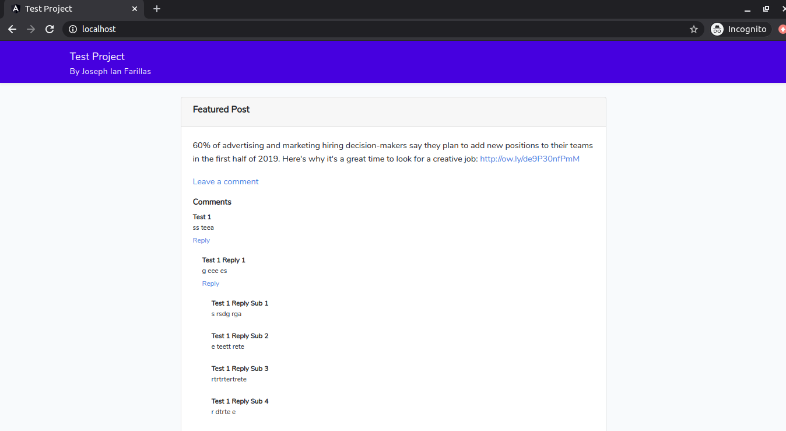

# Aloware Test Project
By Joseph Ian Farillas

A website comment system with Laravel and Vue.js

## Setup
1. Git clone the Test Project
```
git clone https://github.com/jfarillas/aloware-test-project-joseph-ian-farillas.git
```
2. Install dependencies
```
composer install
```
3. Generate Composer's autoloader using the dump-autoload command
```
composer dump-autoload
```
4. Run DB migration script
```
php artisan migrate
```
5. Run backend (Laravel) application on development environment 
```
php artisan serve --port 80
```
6. Run frontend (Vue.js) on development environment
```
sudo npm run dev
```
